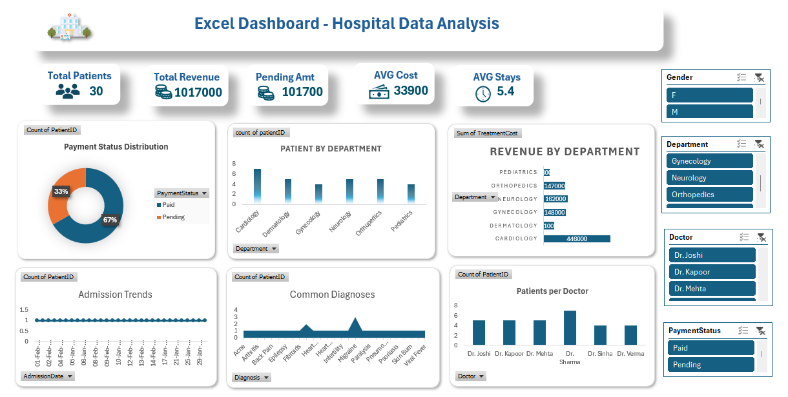

# Hospital Data Analysis Dashboard (Excel)

## Dashboard Preview

## Project Overview

This project analyzes hospital patient data using Microsoft Excel.
An interactive dashboard was built to track patient admissions, departmental performance, revenue generation, payment status, and treatment costs.

The goal of the dashboard is to help hospital administrators quickly understand operational performance and patient trends.

## Tools & Features Used

- Microsoft Excel  
- Pivot Tables  
- Pivot Charts  
- Slicers for filtering  
- KPI Cards  
- Data Aggregation and Calculations  

---

## Key Performance Indicators (KPIs)

The dashboard includes several key metrics that summarize hospital performance.

### Total Patients
Total number of patient records in the dataset.

Example calculation:

`COUNT(PatientID)`

### Total Revenue
Total revenue generated from all treatments.

`SUM(TreatmentCost)`

### Pending Payment Amount
Total value of unpaid treatments.

`SUMIF(PaymentStatus,"Pending",TreatmentCost)`

### Average Treatment Cost
Average cost of treatment across all patients.

`AVERAGE(TreatmentCost)`

### Average Stay Duration
Average number of days patients stayed in the hospital.

`AVERAGE(StayDays)`

---

## Dashboard Visualizations

### Payment Status Distribution
Displays the proportion of **Paid vs Pending payments** using a donut chart.

Purpose:
- Identify outstanding payments  
- Monitor billing efficiency  

---

### Patient Distribution by Department
Bar chart showing the number of patients treated in each department:

- Cardiology  
- Neurology  
- Orthopedics  
- Dermatology  
- Pediatrics  
- Gynecology  

This helps analyze which departments handle the most patients.

---

### Revenue by Department
Shows total treatment revenue generated by each department.

Example insight:
- Cardiology generated the highest revenue in the dataset.

---

### Admission Trends
Line chart showing patient admissions over time.

Purpose:
- Identify admission patterns  
- Monitor hospital workload trends  

---

### Common Diagnoses
Shows the most frequent diagnoses among patients.

This helps identify common medical conditions treated in the hospital.

---

### Patients per Doctor
Bar chart showing how many patients were handled by each doctor.

This helps analyze:
- Doctor workload  
- Patient distribution among doctors  

---

## Interactive Filters

The dashboard includes slicers that allow dynamic filtering by:

- Gender  
- Department  
- Doctor  
- Payment Status  

This allows users to analyze the data from multiple perspectives.

---

## Dataset Structure

The dataset includes fields such as:

- Patient ID  
- Patient Name  
- Age  
- Gender  
- Department  
- Doctor  
- Admission Date  
- Discharge Date  
- Diagnosis  
- Treatment Cost  
- Payment Status  
- Stay Days  

---

## Project Outcome

This dashboard demonstrates how **Excel can be used as a powerful analytical tool** to transform raw hospital data into meaningful insights for decision-making.

### Skills Demonstrated
- Data analysis  
- KPI development  
- Interactive dashboard design  
- Healthcare data analytics
